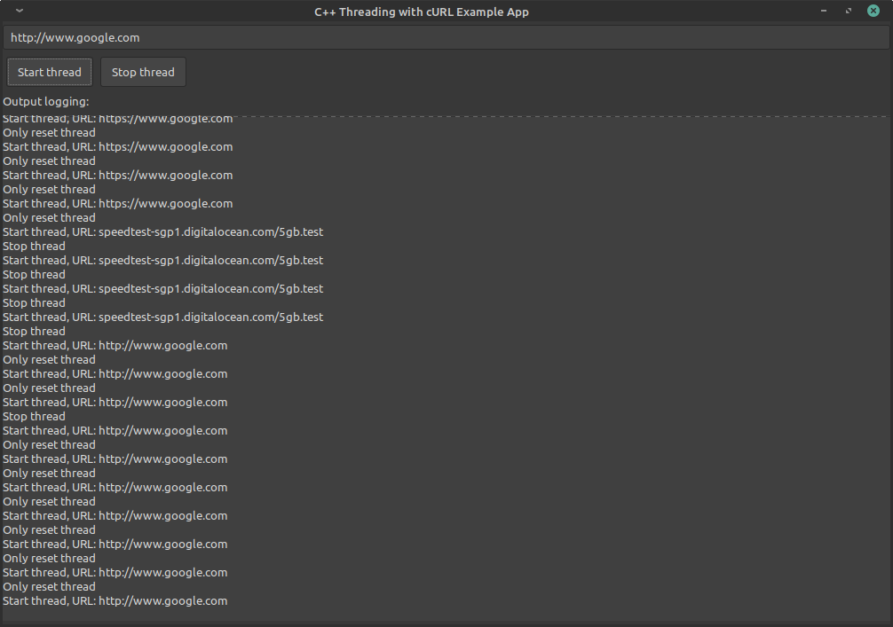

# GTK libcurl multi-threading app

GTK test application using C++ `std::thread` together with [libCURL](https://curl.se/libcurl/), using the [cURL Multi API](https://curl.se/libcurl/c/libcurl-multi.html).

